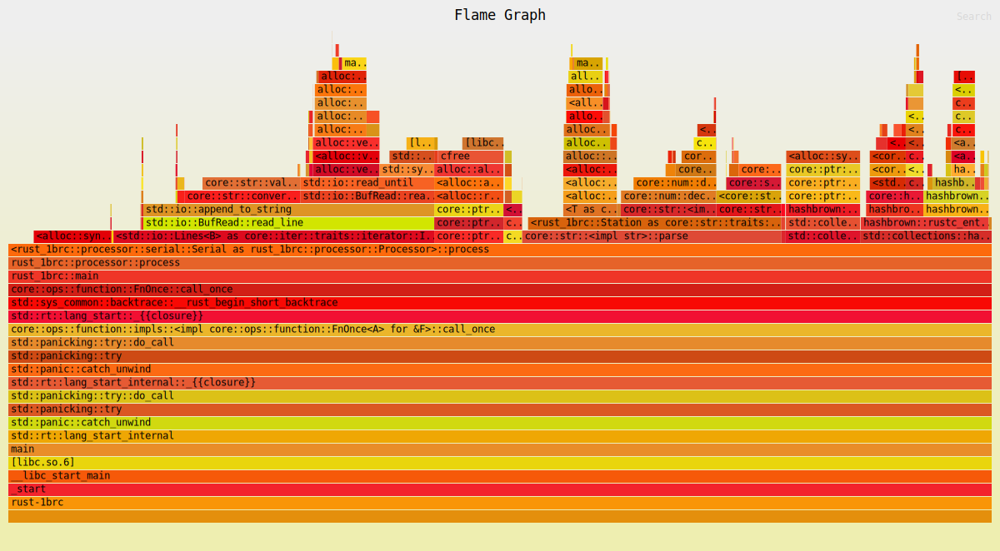

# Results

## Processor

### Baseline

The baseline processor is a simple serial processor. It processes the `measurements.txt`
file line by line and keeps track of the min, max, total, and count of each station.

**Hyperfine Results**:
```
Benchmark 1: target/release/rust-1brc
  Time (mean ± σ):     195.216 s ± 12.837 s    [User: 187.637 s, System: 6.759 s]
  Range (min … max):   171.242 s … 212.396 s    10 runs
```

**Flamegraph**:


### RayonMmapString

The RayonMmapString processor will be the first attempt at speeding up the process. This will
memory map the file, load the contents into a String, iterate over the lines, collect the
results, and fold them together.

**Hyperfine Results**:
```
Benchmark 1: target/release/rust-1brc
  Time (mean ± σ):     120.753 s ±  9.032 s    [User: 604.726 s, System: 39.752 s]
  Range (min … max):   113.123 s … 137.496 s    10 runs
```

**Flamegraph**:


### RayonString

The RayonString is just like the RayoneMmapString, but instead it calls the File::read_to_string
method.

**Hyperfine Results**:
```
Benchmark 1: target/release/rust-1brc
  Time (mean ± σ):     122.032 s ±  8.934 s    [User: 582.529 s, System: 56.085 s]
  Range (min … max):   104.354 s … 132.787 s    10 runs
```

**Flamegraph**:

